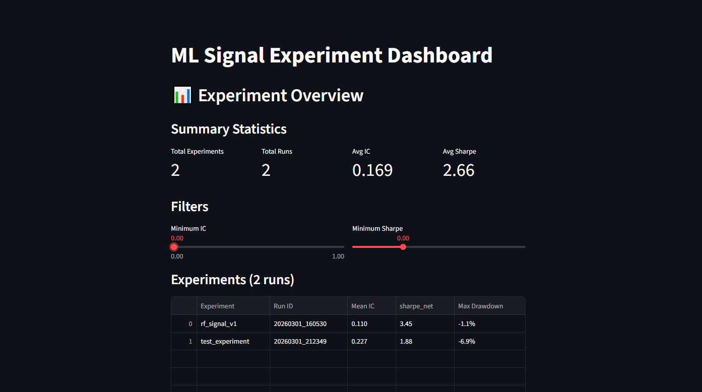
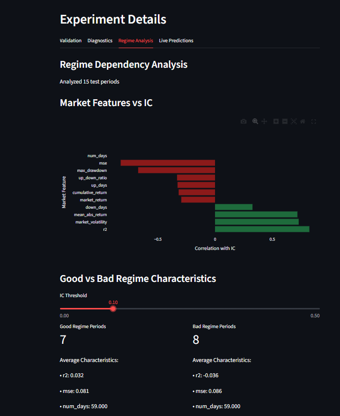
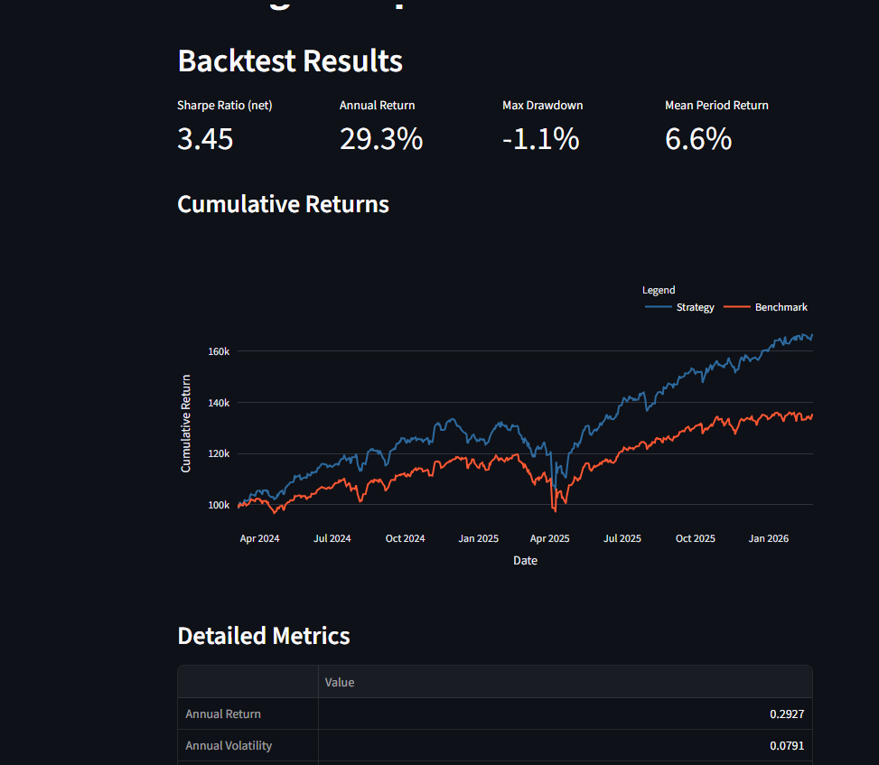
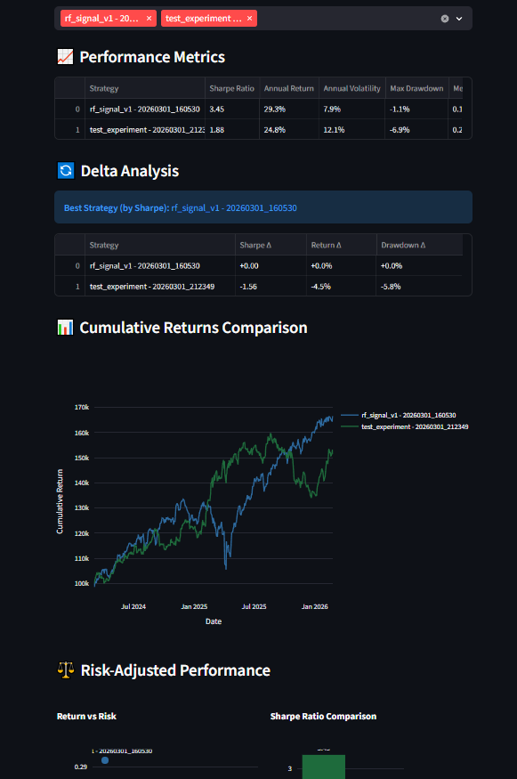

# MLSignalService

I built this project to combine two interests of mine: finance and machine learning.
I was curious whether it’s actually possible to build a structured system that helps answer the question "what should I invest in?".

## Problem Statement

From looking, there are not many finance tools for personal investors that use AI and are transparent enough for you to be able to 
know what is going on. From looking most are either paid for, generic systems, or black box's without any explanations.
I wanted to build my own framework to have more transparency when generating financial signals (and also so I could
learn more deeply about the domain in general)

## Key Results - RF experiment (Over 3 month horizon)

| Metric                             | Value | What It Shows                          |
| ---------------------------------- |-------| -------------------------------------- |
| Information Coefficient (IC)       | 0.110 | Signal has measurable predictive power |
| Shuffle Test p-value               | < 0.01 | Performance unlikely due to randomness |
| Out-of-Sample Sharpe               | 3.45  | Risk-adjusted profitability            |
| Max Drawdown                       | -1.1% | Downside risk is controlled            |

## Architecture

Experiment Config
  └─ tickers, forecast horizon, model type, features, cost assumptions
        ↓
────────────────────────────────────────
1) Data Pipeline
   ├─ Fetch historical market data
   ├─ Clean & align multi-ticker data
   ├─ Feature engineering
   └─ Time-aware train / validation split
        ↓
────────────────────────────────────────
2) Model Development
   ├─ Time-series cross-validation
   ├─ Shuffle / randomization tests
   ├─ Train final model on full dataset
   └─ Generate out-of-sample signals
        ↓
────────────────────────────────────────
3) Statistical Validation & Diagnostics
   ├─ Information Coefficient (IC) analysis
   ├─ Horizon decay analysis
   ├─ Regime stability analysis
   ├─ Model diagnostics
   └─ Feature importance analysis
        ↓
────────────────────────────────────────
4) Portfolio Construction & Backtesting
   ├─ Load and align price data
   ├─ Convert signals → portfolio weights
   └─ Run backtest
        ↓
────────────────────────────────────────
Results Storage (JSON metrics, artifacts, plots)
        ↓
Interactive Dashboard
   ├─ Overview
   ├─ Experiment Details
   ├─ Backtest Results
   └─ Experiment Comparison

## Quickstart

git clone https://github.com/Matt-Chee123/MLSignalService.git

pip install -r requirements.txt

python pipeline/master_pipeline.py --config configs/example.json

cd app

streamlit run app.py

## What I learned

- Ideas often look good initially until tested with
time-series cross-validation or shuffle/randomization tests. So pretty much, robustness matters more than initial performance.

- Small mistakes, e.g. shifting pandas df incorrectly, can completely invalidate results. Must build strict data
pipeline cleaning and validation was essential to avoid accidentally “seeing the future.”

- Making the framework config-driven and storing artifacts allowed me to experiment in a more structured way instead of randomly tweaking models

- More complex models don't automatically mean improved performance 